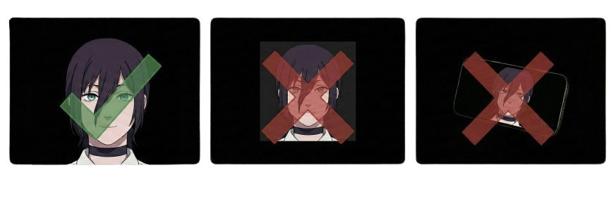
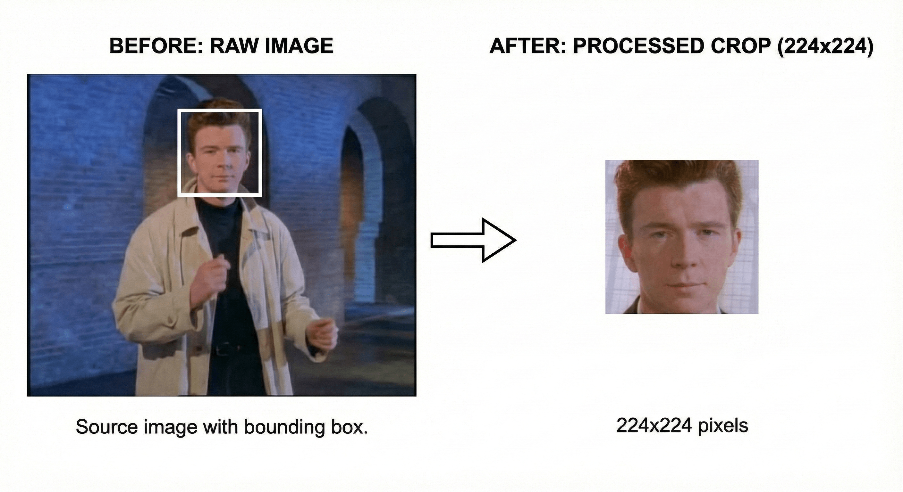

# Face Anti-Spoofing (MobileNetV4, ONNX)

[](LICENSE)
[](https://www.python.org/)
[](https://pytorch.org/)
[](https://onnx.ai/)



A face anti-spoof (liveness) classifier originally implemented in [Suri](https://github.com/johnraivenolazo/suri) and kept here as a standalone training/export repo. It predicts three classes: **real**, **photo attack**, and **video attack**.

---

## Key features

- **Backbone**: MobileNetV4 (feature extractor) with a 3-class classifier head
- **Export**: `src/to_onnx.py` exports a `.pth` checkpoint to a `.onnx` file
- **Dataset prep**: `src/data_prep.py` crops faces using bounding boxes and produces a fixed-size dataset

---


## Pretrained Model

The pretrained model achieves 99% recall on live (real) faces. The model was trained on a balanced dataset with aggressive augmentation and class-weighted sampling to handle the (3) class classification task.

| Class | Precision | Recall | F1-Score | Support |
| :--- | :--- | :--- | :--- | :--- |
| Real | 0.8252 | 0.9920 | 0.9009 | 19,923 |
| Photo | 0.9417 | 0.8316 | 0.8832 | 15,104 |
| Video | 0.8738 | 0.7386 | 0.8005 | 14,619 |
| **Accuracy** | | | **0.8686** | 49,646 |
| **Macro avg** | 0.8802 | 0.8541 | 0.8616 | 49,646 |
| **Weighted avg** | 0.8749 | 0.8686 | 0.8660 | 49,646 |

[View pre-trained models](models/)

---

## Usage

### Data preparation

Use `src/data_prep.py` to crop faces and resize them to a fixed square size (default: 224x224).



Step 1: Check the input folder

The dataset folder should contain:

- Image files (for example, `.jpg` or `.png`)
- A bounding box sidecar text file next to each image, with the same name plus `_BB.txt`
  - Example: `images/0001.jpg` and `images/0001_BB.txt`
- Label JSON files under `metas/labels/`
  - `metas/labels/train_label.json`
  - `metas/labels/test_label.json`


Step 2: Pick an output folder

Choose a folder where the cropped images will be written (it will be created as needed).

Step 3: Run the script

```bash
cd src
python data_prep.py --orig_dir /path/to/dataset_root --crop_dir ../Cropped_Dataset
```

Step 4 (optional): Change size and crop expansion

```bash
cd src
python data_prep.py --orig_dir /path/to/dataset_root --crop_dir ../Cropped_Dataset --size 224 --bbox_inc 1.5
```

Step 5 (optional): Filter by label type codes (if the labels include them)

```bash
cd src
python data_prep.py --orig_dir /path/to/dataset_root --crop_dir ../Cropped_Dataset --spoof_types 0 1 2 3 7 8 9
```

Step 6: Verify the output

- Cropped images should be inside `Cropped_Dataset/` with the same relative paths as the input images.
- The label JSON files should be copied to `Cropped_Dataset/metas/labels/`.

### Training

Step 1: Change directory to `src`

```bash
cd src
```

Step 2: Run training

```bash
python train.py --data-root ../Cropped_Dataset --save-dir ../models
```

The defaults expect:

- `Cropped_Dataset/metas/labels/train_label.json`
- `Cropped_Dataset/metas/labels/test_label.json`

### Export to ONNX

Convert a PyTorch checkpoint to ONNX:

```bash
cd src
python to_onnx.py --input ../model.pth --output ../model.onnx
```

### Demo

Run face detection and antispoof inference on images or webcam:

**With an image:**

```bash
python demo.py --image path/to/image.jpg
```

**With webcam:**

```bash
python demo.py --camera
```

**Custom model paths:**

```bash
python demo.py --image path/to/image.jpg --face-model models/face_detection_yunet_2023mar.onnx --antispoof-model models/best_224.onnx
```

**Custom liveness threshold:**

```bash
python demo.py --camera --threshold 0.6
```

The demo uses YuNet for face detection and the trained antispoof model for liveness detection. Results are displayed with colored bounding boxes: green for "Real" faces (live_score ≥ threshold), red for "Spoof" faces. The default threshold is 0.5.

---

## License

Apache-2.0. See `LICENSE`.
